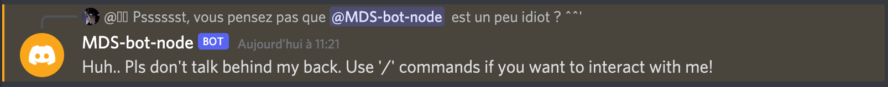

<div align="center">
<h1 style="color: green">MDS-bot-node</h1>
</div>

<br/>

# <span style="color: #258589">What is this project</span>

## This project is a school assignment. I had to make a discord bot

### Requested features:

* provide a command to generate a random number between a minimum and a maximum
* respond with a random phrase when greeted or using a keyword
* respond with a random phrase when mentioned in a message


### Here is an example of using the bot :


### Features implemented

* `hello` - If a message only contains "hello", the bot will reply
* `@MDS-bot-node` - If the bot is mentioned, he will tell you how to interact with him.
* `bot` - If the string 'bot' is in a message, the bot will ask you if you talk about him.
* `CAPS LOCK` - When a user speaks in capital letters, the bot warns him that we are not deaf.
* `/beep` - The bot will answer 'Boop!'
* `/ping` - The bot will answer 'Pong!'
* `/rm n` - The bot will delete the last n messages (you can choose the number of message to be deleted (<100))
* `/echo lorem ipsum dolor` - The bot will repeat what you say
* `/random min max` - The bot will give you a random number between a minimum and a maximum
* `/avatar @user` - The bot will give you the url of the profile picture of the user you mention

<br/>

# <span style="color: #258589">How to use</span>


## Step-1 and final
### Invite the bot into your discord server

[Click here](https://discord.com/api/oauth2/authorize?client_id=951392843740618772&permissions=8&scope=bot%20applications.commands)

<br/>

# <span style="color: #258589">How to manually install</span>

## Step-1

### clone the repo

```bash
git clone https://github.com/us3rT0m/MDS-node-bot-discord
```

## Step-2

### enter the folder

```bash
cd MDS-node-bot-discord/
```

## Step-3

### install the package

```bash
npm i
```

## Step-4

### create a config.json

`Windows users`
```batch
type nul > config.json
```

`Linux | mac users`
```bash
touch config.json
```

## Step-5

### edit config.json

```json
{
    "clientId": "YourBotId",
    "token": "YourBotToken"
}
```
[How to get your clientId](https://discordjs.guide/preparations/adding-your-bot-to-servers.html#creating-and-using-your-invite-link)

[How to get your token](https://discordjs.guide/preparations/setting-up-a-bot-application.html#creating-your-bot)

## Step-5

### execute the project

```bash
npm run start
```

<br/>

# <span style="color: #258589">Governance</span>

### This project is under Founder-leader governance

## **"MDS-bot-node"**  `Belongs To`

* Tom Ait-ouarab ( `Benevolent Dictators for Life` )

See the [contributor](https://github.com/us3rT0m/MDS-bot-node/graphs/contributors)

<br/>

# <span style="color: #258589">License</span>

**<span style="color: green">MDS-bot-node</span> is licensed under the [MIT](./LICENSE) license.**